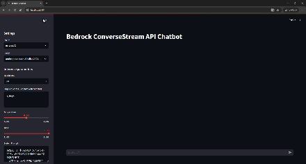
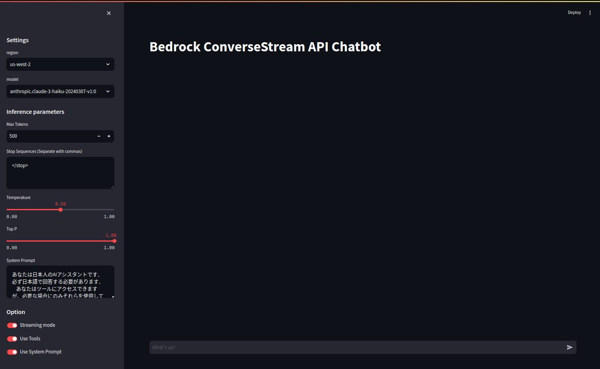
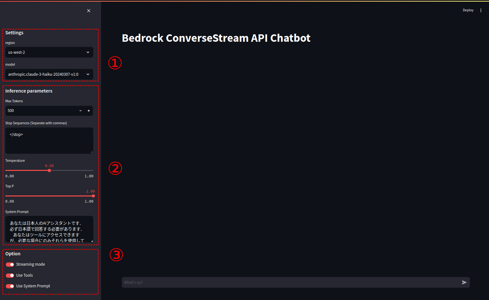
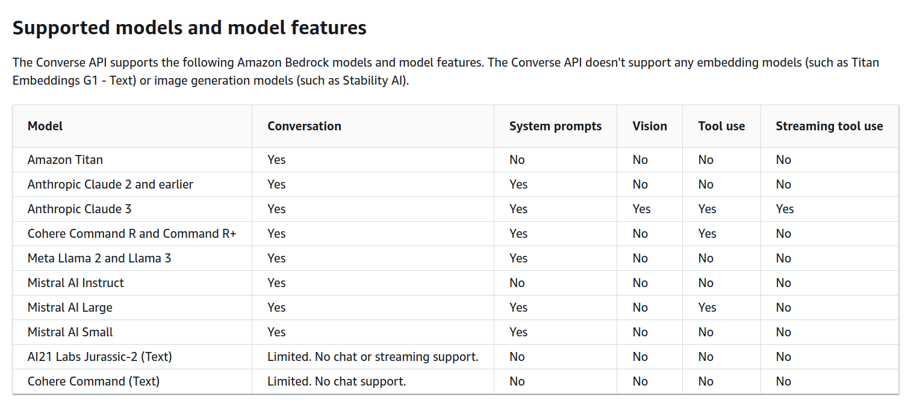

# Bedrock（with Converse API + Tool use）を利用したチャットアプリ<!-- omit in toc -->

本リポジトリでは，Amazon Bedrock の Converse API (Converse [^1-1], ConverseStream[^1-2]) Tool use (function calling) [^1-3], Streamlit を利用したチャットアプリの python 実装を公開する．

> [!NOTE]
> 本アプリおよび，Converse API や Tool use の解説記事を Qiita に投稿しております．
> 是非そちらもご覧下さい！
> <br>
> [Amazon Bedrock Converse API と Tool use を知識ゼロから学び，発展的なチャットアプリを実装する](https://qiita.com/ren8k/items/64c4a3de56b886942251)

> [!NOTE]
> Converse API で Tool use を利用する際の注意点や応用的な内容を，[本ドキュメント](https://github.com/ren8k/aws-bedrock-converse-app-use-tools/blob/main/assets/README.md)に移動しました．Qiita に記載した内容と重複してりますが，ツールリクエスト生成時に CoT を利用する際のコードの改修例などを記載しえとります．是非御覧ください．



## 目次<!-- omit in toc -->

- [目的](#目的)
- [オリジナリティ](#オリジナリティ)
- [前提](#前提)
- [手順](#手順)
- [アプリの機能](#アプリの機能)
  - [1. リージョン・モデルの切り替え機能](#1-リージョンモデルの切り替え機能)
  - [2. 推論パラメータの設定機能](#2-推論パラメータの設定機能)
  - [3. オプション機能](#3-オプション機能)
    - [3-1. ストリーミング機能の利用切り替え](#3-1-ストリーミング機能の利用切り替え)
    - [3-2. Tool use の利用切り替え](#3-2-tool-use-の利用切り替え)
    - [3-3. システムプロンプトの利用切り替え](#3-3-システムプロンプトの利用切り替え)
- [ディレクトリ構成およびコードの説明](#ディレクトリ構成およびコードの説明)
- [References](#references)

## 目的

2024/05/31 に，Amazon Bedrock の新機能である Converse API がリリースされた．本 API では，統一的なインターフェースで Bedrock のモデルの切り替えや推論パラメータの設定，外部のツールの利用（Tool use）などが可能であり，従来の InvokeModel API のようにストリーミング処理も可能である．本リポジトリでは，Converse API の機能を全て活用したチャットアプリを公開し，その機能や気づいた点を紹介する．

## オリジナリティ

執筆時点（2024/06/06）では，以下を満たすチャットアプリは aws-samples などには存在しない．

- ConverseStreamAPI と Tool use を組合せた実装
- Streamlit の ChatUI を利用したチャットアプリケーション
- 参考のため，機能を削ぎ落としたシンプルな実装例も公開
  - `src/basic_code`に格納している

## 前提

- 下記のリージョンで，Bedrock のモデルアクセスの有効化が適切になされている．
  - `us-west-2`
  - `us-east-1`

## 手順

- 本リポジトリをクローン

```bash
git clone https://github.com/ren8k/aws-bedrock-converse-app-use-tools.git
cd aws-bedrock-chat-app-with-use-tools
```

- 仮想環境の作成および有効化（任意）

```bash
python -m venv .venv
source .venv/bin/activate
```

- 必要なライブラリをインストール

```bash
pip install -r requirements.txt
```

- アプリの実行

```bash
cd src/app
bash run_app.sh
```

- ターミナルに表示された URL 経由でアプリを起動



## アプリの機能

本アプリの機能として，① リージョン・モデルの切り替え機能，② 推論パラメータの設定機能，③ オプション機能（ストリーミング機能・Tool use・システムプロンプトの利用選択）がある．本機能は，アプリの左側のサイドバーにて利用可能である．



以降，各機能について説明する．

### 1. リージョン・モデルの切り替え機能

リージョン（`us-west-2` or `us-east-1`）および，Converse API で利用可能なモデルを切り替えることができる．本実装で利用可能なモデルは以下の通りである．

- `anthropic.claude-3-haiku-20240307-v1:0`
- `anthropic.claude-3-sonnet-20240229-v1:0`
- `anthropic.claude-3-opus-20240229-v1:0`
- `cohere.command-r-plus-v1:0`
- `cohere.command-r-v1:0`
- `mistral.mistral-large-2402-v1:0`
- `mistral.mistral-small-2402-v1:0`
- `meta.llama3-70b-instruct-v1:0`
- `ai21.j2-ultra-v1`
- `ai21.j2-mid-v1`
- `amazon.titan-text-premier-v1:0`
- `amazon.titan-text-lite-v1`

### 2. 推論パラメータの設定機能

Converse API では，引数`inference_config`に対し，以下の推論パラメーターを指定することが可能である．本実装では，以下のパラメーターに加え，System Prompt も設定できるようにしている．

- maxTokens: 生成トークンの最大数
- stopSequences: 停止シーケンスのリスト（アプリケーション上ではカンマ区切りで指定）
- temperature: 温度パラメーター
- topP: 予測トークンの予測確率の累積値

### 3. オプション機能

ストリーミング機能の利用，Tool use の利用，システムプロンプトの利用を設定可能である．モデルによっては，ストリーミング機能や Tools，システムプロンプトを利用できない[^5-1]ため，その場合は OFF にして利用することを想定している．以下に，Converse API で利用可能なモデルと，サポートされている機能を示す．なお，以下の表は，執筆時点（2024/06/06）の AWS 公式ドキュメント[^5-1]から引用したものである．



> [!IMPORTANT]
> 特に，Streaming に対応しているのは Claude3 のみである点や，Tool use に対応しているのは Claude3, Command R+, Mistral AI Large のみである点に注意されたい．

以降，各オプション機能について説明する．

#### 3-1. ストリーミング機能の利用切り替え

トグルを ON にすると，`ConverseStream API`を利用でき，OFF にすると，`Converse API`を利用できる．なお，本機能は会話の途中でも自由に切り替えることが可能である．（会話の履歴は引き継がれる．）

#### 3-2. Tool use の利用切り替え

トグルを ON にすると，`Tool use`を利用できる．なお，tools の定義は[`tools_definition.json`](https://github.com/ren8k/aws-bedrock-chat-app-with-use-tools/blob/main/src/app/tools/tools_definition.json)に，tools の実装は[`tools_func.py`](https://github.com/ren8k/aws-bedrock-chat-app-with-use-tools/blob/main/src/app/tools/tools_func.py)に定義してある．

本実装で利用可能なツールは以下の通りである．（簡単のため，ツール内の実装は非常にシンプルにしている．）

- 天気予報取得ツール: 引数として指定された`都道府県`と`市区町村`の天気予報を返す
- Web 検索ツール: 引数として指定された`検索語`で Web 検索を行い、上位 3 件の検索結果のテキストを返す

参考のため，[`tools_definition.json`](https://github.com/ren8k/aws-bedrock-chat-app-with-use-tools/blob/main/src/app/tools/tools_definition.json)と[`tools_func.py`](https://github.com/ren8k/aws-bedrock-chat-app-with-use-tools/blob/main/src/app/tools/tools_func.py)の実装を以下に示す．（tools の実装については，AWS 公式リポジトリの実装例を参考にさせていただきました．）[^5-2]

<details>
<summary>tools関連の実装</summary>
<br/>

**tools_definition.json**

```json
[
  {
    "toolSpec": {
      "name": "get_weather",
      "description": "Get weather of a location.",
      "inputSchema": {
        "json": {
          "type": "object",
          "properties": {
            "prefecture": {
              "type": "string",
              "description": "prefecture of the location"
            },
            "city": {
              "type": "string",
              "description": "city of the location"
            }
          },
          "required": ["prefecture", "city"]
        }
      }
    }
  },

  {
    "toolSpec": {
      "name": "web_search",
      "description": "Search a term in the public Internet. Useful for getting up to date information.",
      "inputSchema": {
        "json": {
          "type": "object",
          "properties": {
            "search_term": {
              "type": "string",
              "description": "Term to search in the Internet"
            }
          },
          "required": ["search_term"]
        }
      }
    }
  }
]
```

<br>

**tools_func.py**

```python
import requests
from bs4 import BeautifulSoup
from googlesearch import search


class ToolsList:
    # Define our get_weather tool function...
    def get_weather(self, prefecture, city):
        result = f"Weather in {prefecture}, {city} is 70F and clear skies."
        print(f"Tool result: {result}")
        return result

    # Define our web_search tool function...
    def web_search(self, search_term):
        results = []
        response_list = []
        results.extend([r for r in search(search_term, 3, "en")])
        for j in results:
            response = requests.get(j)
            if response.status_code == 200:
                soup = BeautifulSoup(response.text, "html.parser")
                response_list.append(soup.get_text().strip())
        response_text = ",".join(str(i) for i in response_list)
        # print(f"Search results: {response_text}")
        return response_text

```

</details>
<br/>

#### 3-3. システムプロンプトの利用切り替え

トグルを ON にすると，`Converse API`および`ConverseStream API`の 引数`system`にシステムプロンプトを指定することができる．

## ディレクトリ構成およびコードの説明

本アプリケーションの実装は，`src/app`ディレクトリ直下に配置されている．以下にディレクトリ構成を示す．

```
.
├── app.py                            : Streamlit アプリケーションのエントリーポイント
├── components
│   ├── __init__.py
│   ├── chat_interface_standard.py    : Converse API を利用した chat interface
│   ├── chat_interface_streaming.py   : ConverseStream API を利用した chat interface
│   └── sidebar.py                    : UI のサイドバー
├── config
│   └── config.py                     : モデルの設定情報 (推論パラメーター，toolsの設定)
├── llm
│   ├── __init__.py
│   └── bedrock_client.py             : Bedrock API のクライアント
├── run_app.sh                        : Streamlit アプリケーションの起動スクリプト
├── tools
│   ├── __init__.py
│   ├── tools_definition.json         : tools の定義
│   └── tools_func.py                 : tools の実装 (天気予報取得，Web検索)
└── utils
    ├── __init__.py
    └── utils.py                      : ユーティリティ関数
```

## References

[^1-1]: [Converse](https://docs.aws.amazon.com/bedrock/latest/APIReference/API_runtime_Converse.html)
[^1-2]: [ConverseStream](https://docs.aws.amazon.com/bedrock/latest/APIReference/API_runtime_ConverseStream.html)
[^1-3]: [Tool use (function calling)](https://docs.aws.amazon.com/bedrock/latest/userguide/tool-use.html)
[^5-1]: [Use the Converse API/Supported models and model features](https://docs.aws.amazon.com/bedrock/latest/userguide/conversation-inference.html#conversation-inference-supported-models-features)
[^5-2]: [Function-Calling（Tool Use） with Converse API in Amazon Bedrock](https://github.com/aws-samples/amazon-bedrock-samples/blob/b64902625ea8ade362c0f7d1978428cecdcf47ed/function-calling/Function%20calling%20tool%20use%20with%20Converse%20API.ipynb)
