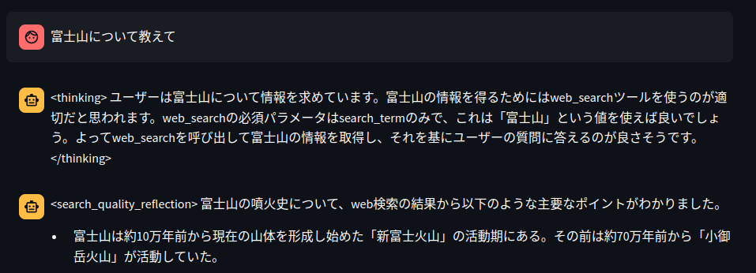

# Bedrock（with Converse API + Tool use）を利用したチャットアプリ<!-- omit in toc -->

本リポジトリでは，Amazon Bedrock の Comverse API を利用したチャットアプリを公開している．

<video src="https://github.com/ren8k/aws-bedrock-chat-app-with-use-tools/blob/develop/assets/demo.mp4" autoplay>

## 目次<!-- omit in toc -->

- [目的](#目的)
- [オリジナリティ](#オリジナリティ)
- [前提](#前提)
- [手順](#手順)
- [アプリの機能](#アプリの機能)
  - [1. リージョン・モデルの切り替え機能](#1-リージョンモデルの切り替え機能)
  - [2. 推論パラメータの設定機能](#2-推論パラメータの設定機能)
  - [3. オプション機能](#3-オプション機能)
    - [3-1. ストリーミング機能の利用切り替え](#3-1-ストリーミング機能の利用切り替え)
    - [3-2. Use tools の利用切り替え](#3-2-use-tools-の利用切り替え)
    - [3-3. システムプロンプトの利用切り替え](#3-3-システムプロンプトの利用切り替え)
- [ディレクトリ構成およびコードの説明](#ディレクトリ構成およびコードの説明)
- [開発の過程で気づいた点](#開発の過程で気づいた点)
  - [モデルが不必要にツールを利用してしまう課題](#モデルが不必要にツールを利用してしまう課題)
  - [Use tools で Claude3 Opus を利用したの場合のレスポンスについて](#use-tools-で-claude3-opus-を利用したの場合のレスポンスについて)
  - [ツール実行のための引数生成が必ずしも成功するとは限らない](#ツール実行のための引数生成が必ずしも成功するとは限らない)
  - [会話履歴にツールの利用履歴がある場合，引数 toolConfig 無しで会話できない](#会話履歴にツールの利用履歴がある場合引数-toolconfig-無しで会話できない)
  - [Amazon Titan で Converse API を利用する際の引数`stop sequence`について](#amazon-titan-で-converse-api-を利用する際の引数stop-sequenceについて)
  - [AI21 Lab で Converse API を利用する際の引数`messages`について](#ai21-lab-で-converse-api-を利用する際の引数messagesについて)
- [References](#references)

## 目的

2024/05/31 に，Amazon Bedrock の新機能である Converse API がリリースされた．本 API では，統一的なインターフェースで Bedrock のモデルの切り替えや推論パラメータの設定，外部のツールの利用（Use tools）などが可能であり，従来の InvokeModel API のようにストリーミング処理も可能である．本リポジトリでは，Converse API の機能を全て活用したチャットアプリを公開し，その機能や気づいた点を紹介する．

## オリジナリティ

執筆時点（2024/06/06）では，以下を満たすチャットアプリは aws-samples などには存在しない．

- ConverseStreamAPI と Use tools を組合せた実装
- Streamlit の ChatUI を利用したチャットアプリケーション
- 参考のため，機能を削ぎ落としたシンプルな実装例も公開
  - `src/basic_code`に格納している

## 前提

- 下記のリージョンで，Bedrock のモデルアクセスの有効化が適切になされている．
  - `us-west-2`
  - `us-east-1`

## 手順

- 本リポジトリをクローン

```bash
git clone https://github.com/ren8k/aws-bedrock-chat-app-with-use-tools.git
cd aws-bedrock-chat-app-with-use-tools
```

- 仮想環境の作成および有効化（任意）

```bash
python -m venv .venv
source .venv/bin/activate
```

- 必要なライブラリをインストール

```bash
pip install -r requirements.txt
```

- アプリの実行．

```bash
cd src/app
bash run_app.sh
```

- ターミナルに表示された URL 経由でアプリが自動起動


## アプリの機能

本アプリの機能として，① リージョン・モデルの切り替え機能，② 推論パラメータの設定機能，③ オプション機能（ストリーミング機能・Use tools・システムプロンプトの利用選択）がある．本機能は，アプリの左側のサイドバーにて利用可能である．


以降，各機能について説明する．

### 1. リージョン・モデルの切り替え機能

リージョン（`us-west-2` or `us-east-1`）および，Converse API で利用可能なモデルを切り替えることができる．本実装で利用可能なモデルは以下の通りである．

- `anthropic.claude-3-haiku-20240307-v1:0`
- `anthropic.claude-3-sonnet-20240229-v1:0`
- `anthropic.claude-3-opus-20240229-v1:0`
- `cohere.command-r-plus-v1:0`
- `cohere.command-r-v1:0`
- `mistral.mistral-large-2402-v1:0`
- `mistral.mistral-small-2402-v1:0`
- `meta.llama3-70b-instruct-v1:0`
- `ai21.j2-ultra-v1`
- `ai21.j2-mid-v1`
- `amazon.titan-text-premier-v1:0`
- `amazon.titan-text-lite-v1`

### 2. 推論パラメータの設定機能

Converse API では，引数`inference_config`に対し，以下の推論パラメーターを指定することが可能である．本実装では，以下のパラメーターに加え，System Prompt も設定できるようにしている．

- maxTokens: 生成トークンの最大数
- stopSequences: 停止シーケンスのリスト（アプリケーション上ではカンマ区切りで指定）
- temperature: 温度パラメーター
- topP: 予測トークンの予測確率の累積値

### 3. オプション機能

ストリーミング機能の利用，Use tools の利用，システムプロンプトの利用を設定可能である．モデルによっては，ストリーミング機能や Tools，システムプロンプトを利用できない[^5-1]ため，その場合は OFF にして利用することを想定している．以下に，Converse API で利用可能なモデルと，サポートされている機能を示す．なお，以下の表は，執筆時点（2024/06/06）の AWS 公式ドキュメント[^5-1]から引用したものである．


> [!IMPORTANT]
> 特に，Streaming に対応しているのは Claude3 のみである点や，Use tools に対応しているのは Claude3, Command R+, Mistral AI Large のみである点に注意されたい．

以降，各オプション機能について説明する．

#### 3-1. ストリーミング機能の利用切り替え

トグルを ON にすると，`ConverseStream API`を利用でき，OFF にすると，`Converse API`を利用できる．なお，本機能は会話の途中でも自由に切り替えることが可能である．（会話の履歴は引き継がれる．）

#### 3-2. Use tools の利用切り替え

トグルを ON にすると，`Use tools`を利用できる．なお，tools の定義は[`tools_definition.json`](https://github.com/ren8k/aws-bedrock-chat-app-with-use-tools/blob/main/src/app/tools/tools_definition.json)に，tools の実装は[`tools_func.py`](https://github.com/ren8k/aws-bedrock-chat-app-with-use-tools/blob/main/src/app/tools/tools_func.py)に定義してある．

本実装で利用可能なツールは以下の通りである．（簡単のため，ツール内の実装は非常にシンプルにしている．）

- 天気予報取得ツール: 引数として指定された`都道府県`と`市区町村`の天気予報を返す
- Web 検索ツール: 引数として指定された`検索語`で Web 検索を行い、上位 3 件の検索結果のテキストを返す

参考のため，[`tools_definition.json`](https://github.com/ren8k/aws-bedrock-chat-app-with-use-tools/blob/main/src/app/tools/tools_definition.json)と[`tools_func.py`](https://github.com/ren8k/aws-bedrock-chat-app-with-use-tools/blob/main/src/app/tools/tools_func.py)の実装を以下に示す．（tools の実装については，AWS 公式リポジトリの実装例を参考にさせていただきました．）[^5-2]

<details>
<summary>tools関連の実装</summary>
<br/>

**tools_definition.json**

```json
[
  {
    "toolSpec": {
      "name": "get_weather",
      "description": "Get weather of a location.",
      "inputSchema": {
        "json": {
          "type": "object",
          "properties": {
            "prefecture": {
              "type": "string",
              "description": "prefecture of the location"
            },
            "city": {
              "type": "string",
              "description": "city of the location"
            }
          },
          "required": ["prefecture", "city"]
        }
      }
    }
  },

  {
    "toolSpec": {
      "name": "web_search",
      "description": "Search a term in the public Internet. Useful for getting up to date information.",
      "inputSchema": {
        "json": {
          "type": "object",
          "properties": {
            "search_term": {
              "type": "string",
              "description": "Term to search in the Internet"
            }
          },
          "required": ["search_term"]
        }
      }
    }
  }
]
```

<br>

**tools_func.py**

```python
import requests
from bs4 import BeautifulSoup
from googlesearch import search


class ToolsList:
    # Define our get_weather tool function...
    def get_weather(self, prefecture, city):
        result = f"Weather in {prefecture}, {city} is 70F and clear skies."
        print(f"Tool result: {result}")
        return result

    # Define our web_search tool function...
    def web_search(self, search_term):
        results = []
        response_list = []
        results.extend([r for r in search(search_term, 3, "en")])
        for j in results:
            response = requests.get(j)
            if response.status_code == 200:
                soup = BeautifulSoup(response.text, "html.parser")
                response_list.append(soup.get_text().strip())
        response_text = ",".join(str(i) for i in response_list)
        # print(f"Search results: {response_text}")
        return response_text

```

</details>
<br/>

#### 3-3. システムプロンプトの利用切り替え

トグルを ON にすると，`Converse API`および`ConverseStream API`の 引数`system`にシステムプロンプトを指定することができる．

## ディレクトリ構成およびコードの説明

本アプリケーションの実装は，`src/app`ディレクトリ直下に配置されている．以下にディレクトリ構成を示す．

```
.
├── app.py                            : Streamlit アプリケーションのエントリーポイント
├── components
│   ├── __init__.py
│   ├── chat_interface_standard.py    : Converse API を利用した chat interface
│   ├── chat_interface_streaming.py   : ConverseStream API を利用した chat interface
│   └── sidebar.py                    : UI のサイドバー
├── config
│   └── config.py                     : モデルの設定情報 (推論パラメーター，toolsの設定)
├── llm
│   ├── __init__.py
│   └── bedrock_client.py             : Bedrock API のクライアント
├── run_app.sh                        : Streamlit アプリケーションの起動スクリプト
├── tools
│   ├── __init__.py
│   ├── tools_definition.json         : tools の定義
│   └── tools_func.py                 : tools の実装 (天気予報取得，Web検索)
└── utils
    ├── __init__.py
    └── utils.py                      : ユーティリティ関数
```

## 開発の過程で気づいた点

以下に，Use tools および Converse API の利用時に気をつけておくべき点をまとめる．

### モデルが不必要にツールを利用してしまう課題

Use tools の設定を行った上で Converse API を利用すると，モデルが不必要にツールを利用してしまうことがある．例えば，モデルの知識で十分回答できる質問に対しても，Web 検索ツールを利用して回答してしまう．個人的な印象としては，Claude3 Haiku や Opus はツールを利用することが非常に多く，プロンプトでの制御も難しい．一方，Claude3 Sonnet もツールを利用する傾向が強いが，プロンプトでの制御がある程度効きやすい．

以下に，各モデルにおけるツールの利用傾向を示す．（下記は個人環境での実験結果に基づく主観的な印象である点に注意されたい．）

| モデル         | ツールの利用傾向                                         |
| -------------- | -------------------------------------------------------- |
| Claude3 Haiku  | 問答無用でツールを利用                                   |
| Claude3 Sonnet | ツールを積極的に利用する傾向が強いがプロンプトで制御可能 |
| Claude3 Opus   | CoT の過程でどのツールを利用すべきかを思考して利用       |

Anthropic の公式ドキュメント[^6-1]やコード[^6-2]を参考に，下記のようなシステムプロンプトを作成することで，Claude3 Sonnet ではツールの利用を抑制することができた．下記プロンプトの特徴としては，「必要な場合のみツールを利用する」ように指示している点である．

```
あなたは日本人のAIアシスタントです．必ず日本語で回答する必要があります．
あなたはツールにアクセスできますが、必要な場合にのみそれらを使用してください。

自身の知識で回答できない場合のみ，関連するツールを使用してユーザーの要求に答えてください。

まず、提供されたツールのうち、ユーザーの要求に答えるのに関連するツールはどれかを考えてください。次に、関連するツールの必須パラメータを1つずつ確認し、ユーザーが直接提供したか、値を推測するのに十分な情報を与えているかを判断します。

パラメータを推測できるかどうかを決める際は、特定の値をサポートするかどうかを慎重に検討してください。ただし、必須パラメータの値の1つが欠落している場合は、関数を呼び出さず(欠落しているパラメータに値を入れても呼び出さない)、代わりにユーザーに欠落しているパラメータの提供を求めてください。提供されていないオプションのパラメータについては、追加情報を求めないでください。
```

上記のシステムプロンプトを利用した場合の応答例を以下に示す．下記では，富士山については自身の知識で回答しており，Amazon Bedrock については知識が無いため，Web 検索ツールを利用している．


レスポンスの速度や，ツールの利用状況を考慮すると，Claude3 Sonnet は有力なモデルの選択肢であると考えられる．

### Use tools で Claude3 Opus を利用したの場合のレスポンスについて

Use tools の設定を行った上で，Claude3 Opus で Converse API を利用すると，レスポンスに必ず CoT の内容が含まれる．具体的には，Converse API で引数`toolConfig`を指定すると，以下のように，`<thinking>`タグ内でどの tools を利用すべきかを思考する．本現象は仕様なのかは不明であるが，もし仕様であれば，CoT の内容は出力しないように工夫すると良いかもしれない．



### ツール実行のための引数生成が必ずしも成功するとは限らない

Use tools では，LLM がツールの引数を生成し，ユーザーがツールの実行を行うが，必ずしもツールの引数生成が成功するとは限らない．Claude3 を利用する場合はほぼ失敗はしないが，Command R+ などのモデルを利用する場合，ツールの引数生成に失敗（引数が不足するなど）することが度々ある．

ツールの引数生成失敗に伴うツールの実行失敗を回避するためのリトライの仕組みを実装することが望ましい．（本実装では取り入れていないが，ツールの実行に失敗した場合，エラーの内容を含めて LLM に情報を送信し，それを踏まえて再度引数を生成させることは可能である．[^6-3]）

### 会話履歴にツールの利用履歴がある場合，引数 toolConfig 無しで会話できない

Converse API の引数`messages`に，ツールの利用履歴である`toolUse`や`toolResult`を含む場合，Converse API の引数`toolConfig`を指定する必要がある．例えば，ツールの利用後，会話の途中で引数`toolConfig`を指定せずに Converse API を利用すると，以下のエラーが出る．

```
botocore.errorfactory.ValidationException: An error occurred (ValidationException) when calling the Converse operation: The toolConfig field must be defined when using toolUse and toolResult content blocks.
```

本アプリでは，ツールの利用有無をいつでも切り替えることができるが，ツール有り-> ツール無しに切り替える場合，エラーが発生し得る点に注意されたい．

### Amazon Titan で Converse API を利用する際の引数`stop sequence`について

Amazon Titan で Converse API を利用する場合，引数`stop sequence`の指定の仕方が他のモデルと異なる．具体的には，引数`stop sequence`には，正規表現パターン「^(|+|User:)$」にマッチするような文字列しか指定できない．例えば，Amazon Titan で 引数`stop sequence=["</stop>"]`を指定して Converse API を利用すると以下のエラーが出る．

```
ValidationException: An error occurred (ValidationException) when calling the Converse operation: The model returned the following errors: Malformed input request: string [</stop>] does not match pattern ^(\|+|User:)$, please reformat your input and try again.
```

本アプリでは，Amazon Titan を選択した場合，`stop sequence`のデフォルト値として`User:`を指定するようにしている．

### AI21 Lab で Converse API を利用する際の引数`messages`について

- AI21 Labs Jurassic-2 で Converse API を利用する場合，引数`messages`に会話履歴を含めることはできない．具体的には，引数`messages`に`assistant`の応答内容を含めると以下のエラーが出る．

```
botocore.errorfactory.ValidationException: An error occurred (ValidationException) when calling the Converse operation: This model doesn't support conversation history. Try again with input that only includes one user message.
```

## References

[^5-1]: [Use the Converse API/Supported models and model features](https://docs.aws.amazon.com/bedrock/latest/userguide/conversation-inference.html#conversation-inference-supported-models-features)
[^5-2]: [Function-Calling（Tool Use） with Converse API in Amazon Bedrock](https://github.com/aws-samples/amazon-bedrock-samples/blob/b64902625ea8ade362c0f7d1978428cecdcf47ed/function-calling/Function%20calling%20tool%20use%20with%20Converse%20API.ipynb)
[^6-1]: [Chain of thought tool use](https://docs.anthropic.com/en/docs/tool-use-examples#chain-of-thought-tool-use)
[^6-2]: [anthropics/courses/ToolUse/02_your_first_simple_tool.ipynb](https://github.com/anthropics/courses/blob/master/ToolUse/02_your_first_simple_tool.ipynb)
[^6-3]: [Use tools with an Amazon Bedrock model](https://docs.aws.amazon.com/bedrock/latest/userguide/tool-use.html)
